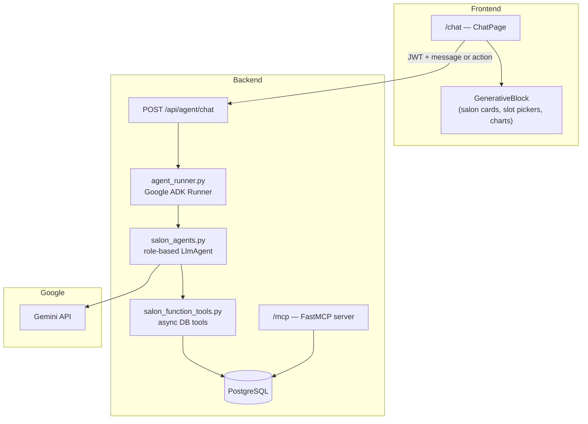

# SalonBook AI Assistant

Role-aware conversational assistant for customers, salon owners, and admins. Users chat at **`/chat`** to search salons, book appointments, manage businesses, and view analytics — with **generative UI** (clickable cards, pickers, charts) instead of typing everything manually.

Built with **Google ADK 2.x**, **Gemini**, and live data from the SalonBook PostgreSQL database.

---

## Quick start

1. Add a Gemini API key to `backend/.env`:
   ```env
   GOOGLE_API_KEY=your-key-from-aistudio.google.com
   LLM_MODEL=gemini-2.5-flash
   ```
2. Start backend and frontend (see [README.md](README.md)).
3. Sign in with a demo account (see [TESTING.md](TESTING.md)).
4. Open **AI Assistant** in the sidebar or go to `/chat`.

---

## Architecture



| Layer | Purpose |
|-------|---------|
| **Chat UI** | Sends user text or UI actions (`select_salon`, `select_slot`, etc.) |
| **Chat API** | Authenticates user, runs ADK agent, returns `message` + `ui_blocks` |
| **ADK agents** | One agent per role (customer / owner / admin) with structured output |
| **Function tools** | Async wrappers over `agent_tools.py` — same logic as REST APIs |
| **MCP server** | Exposes DB tools at `/mcp` for external MCP clients (Cursor, ADK stdio, etc.) |

---

## Role-based capabilities

### Customer (`customer@demo.com`)

| You can ask… | What happens |
|--------------|--------------|
| "Find hair salons in Mumbai" | Agent searches approved salons, returns **salon cards** |
| Tap **View & book** on a salon | Shows **services** and **available slots** |
| Pick service + slot | **Booking summary** → confirm |
| "Show my bookings" | Lists your upcoming appointments |

**Tools:** `search_salons`, `get_salon_details`, `list_available_slots`, `create_booking`, `get_my_bookings`

### Owner (`owner@demo.com`)

| You can ask… | What happens |
|--------------|--------------|
| "Show my earnings this month" | **Earnings chart** from confirmed bookings |
| "Compare earnings 2026-01 vs 2026-02" | **Comparison chart** between two periods |
| "Help me add a new salon" | Guided flow → creates salon (pending admin approval) |
| Add services to your salon | Uses `add_salon_service` tool |

**Tools:** All customer tools plus `get_owner_salons`, `create_salon`, `add_salon_service`, `get_owner_earnings`, `compare_owner_earnings`

### Admin (`admin@demo.com`)

| You can ask… | What happens |
|--------------|--------------|
| "Platform analytics overview" | **Analytics summary** (users, salons, revenue) |
| "Top clients by bookings" | **Client list** ranked by activity |
| "Show pending salon approvals" | Lists salons with `status=pending` |

**Tools:** Owner tools plus `get_platform_analytics`, `list_top_clients`, `list_salons_admin`

---

## Generative UI

Assistant replies include `ui_blocks` — interactive components the frontend renders. Tapping a block sends an **action** back to the agent (no retyping).

| Block type | Renders | User action |
|------------|---------|-------------|
| `salon_list` | Salon cards with location & rating | `select_salon` |
| `service_picker` | Service buttons with prices | `select_service` |
| `slot_picker` | Date/time grid | `select_slot` |
| `booking_summary` | Booking details | `confirm_booking` |
| `earnings_chart` | Monthly earnings bars | — |
| `comparison_chart` | Period A vs B | — |
| `analytics_summary` | Platform KPI tiles | — |
| `client_list` | Top clients table | — |
| `actions` | Generic action buttons | varies |

User selections appear in chat as readable labels (e.g. `Haircut — ₹499`, `2026-06-22 at 12:00`) — not raw action names.

---

## Chat API

**Endpoint:** `POST /api/agent/chat`  
**Auth:** Bearer JWT (must be logged in)

### Request

```json
{
  "message": "Find salons in Mumbai",
  "session_id": "optional-uuid-for-multi-turn",
  "action": "select_salon",
  "action_payload": {
    "salon_id": "9e04b478-...",
    "name": "Glow Studio"
  }
}
```

- Send **`message`** for free-text chat.
- Send **`action` + `action_payload`** when the user taps a generative UI control (message can be empty).
- Reuse **`session_id`** from the previous response to keep conversation context.

### Response

```json
{
  "session_id": "uuid",
  "message": "Here are some salons in Mumbai:",
  "role": "customer",
  "ui_blocks": [
    {
      "type": "salon_list",
      "title": null,
      "data": {
        "salons": [
          {
            "id": "...",
            "name": "Glow Studio",
            "city": "Mumbai",
            "address": "Bandra West, Mumbai"
          }
        ]
      },
      "actions": []
    }
  ]
}
```

---

## Configuration

Add to `backend/.env`:

| Variable | Required | Description |
|----------|----------|-------------|
| `GOOGLE_API_KEY` | Yes | [Google AI Studio](https://aistudio.google.com/apikey) API key |
| `LLM_MODEL` | No | Gemini model (default: `gemini-2.5-flash`) |
| `MCP_SERVER_URL` | No | MCP HTTP endpoint (default: `http://127.0.0.1:8000/mcp`) |

### Switching models (quota limits)

Free-tier quotas are **per model**. If you hit `429 RESOURCE_EXHAUSTED`, change `LLM_MODEL` and restart the backend:

```env
# Recommended fallbacks (check your key — availability varies)
LLM_MODEL=gemini-2.5-flash-lite
# LLM_MODEL=gemini-3-flash-preview
# LLM_MODEL=gemini-flash-latest
```

Monitor usage: [ai.dev/rate-limit](https://ai.dev/rate-limit)

---

## MCP server (external tools)

SalonBook exposes a **Model Context Protocol** server at **`http://localhost:8000/mcp`** (Streamable HTTP), mounted on the same FastAPI process.

Tools mirror the marketplace APIs: salon search, bookings, owner earnings, admin analytics. Authenticated calls pass headers:

- `X-User-Id` — user UUID  
- `X-User-Role` — `customer`, `owner`, or `admin`

**Standalone stdio MCP** (for Cursor / other MCP clients):

```bash
./scripts/run-mcp.sh
```

The in-app chat agent uses **native ADK function tools** (`salon_function_tools.py`) for reliability; the MCP server shares the same `agent_tools.py` data layer.

---

## Project layout

```
backend/app/
├── agents/
│   ├── salon_agents.py          # ADK LlmAgent definitions (per role)
│   └── salon_function_tools.py  # Async tools used by agents
├── mcp/
│   └── server.py                # FastMCP server → /mcp
├── routers/
│   └── agent.py                 # POST /api/agent/chat
├── schemas/
│   └── agent.py                 # ChatRequest, ChatResponse, UIBlock
└── services/
    ├── agent_tools.py           # Shared DB operations
    ├── agent_runner.py          # ADK Runner + sessions
    └── agent_response_parser.py # Structured output parsing

frontend/src/
├── pages/ChatPage.tsx           # Chat interface
├── components/chat/GenerativeBlock.tsx
└── lib/chatNormalize.ts         # JSON fallback + action labels
```

---

## Troubleshooting

| Issue | Fix |
|-------|-----|
| `503 AI agent is not configured` | Set `GOOGLE_API_KEY` in `backend/.env` and restart backend |
| `429` quota exceeded | Switch `LLM_MODEL` to another Gemini model (see above) |
| Raw JSON in chat bubble | Should be parsed automatically; refresh after backend update |
| `Tool 'search_salons' not found` | Restart backend (agent tools load at startup) |
| DB connection errors in chat | Ensure PostgreSQL is running; restart backend |
| Chat requires login | `/chat` is protected — sign in first |

---

## Demo script (2 minutes)

1. Login as `customer@demo.com` / `password123`
2. Go to **AI Assistant** → type *"Find hair salons in Mumbai"*
3. Tap **View & book** on a salon → pick a service → pick a slot → **Confirm booking**
4. Logout → login as `owner@demo.com` → ask *"Show my earnings this month"*
5. Logout → login as `admin@demo.com` → ask *"Platform analytics overview"*

Full test flows: [TESTING.md](TESTING.md)
